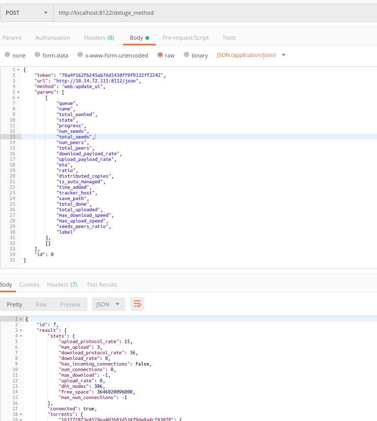

## another Deluge Api

### this solves the limitations and issues(IMHO) of the current Deluge WebApi

##### I found issues with cors and headers from the browser while trying to access Deluge webApi - hosting deluge in a docker container, on my nas

##### Solution, a simple proxy using Node and Axios - that exposes all Deluge webApi methods.

to use 
```bash
git clone https://github.com/jasenmichael/delugeApiProxy.git
cd delugeApiProxy
npm run start
```
go to see list of routes
http://localhost:8122/   note: proxy api default port 8122 - deluge default port is 8112 
don't get confuzed ;)

make POST request with options in the body

login - returns token -use in subsequent requests
http://localhost:8122/login
```js
body: {
    url: 'http://delugeBox:8122/json',   // deluge webApi url
    password: 'deluge'
}
```

periodically check session, if not valid then you must relogin and get a new token
http://localhost:8122/check_session
```js
body: {
    url: 'http://delugeBox:8112/json',   // deluge webApi url
    token
}
```


http://localhost:8122/list_methods
```js
body: {
    url: 'http://delugeBox:8112/json',   // deluge webApi url
}
```

http://localhost:8122/deluge_method
use any method from the list_methods
```js
body: {   
    url: 'http://delugeBox:8112/json',   // deluge webApi url
    token,
    method: "web.update_ui",
    params: [
        [
            "queue",
            "name",
            "total_wanted",
            "state",
            "progress",
            "num_seeds",
            "total_seeds",
            "num_peers",
            "total_peers",
            "download_payload_rate",
            "upload_payload_rate",
            "eta",
            "ratio",
            "distributed_copies",
            "is_auto_managed",
            "time_added",
            "tracker_host",
            "save_path",
            "total_done",
            "total_uploaded",
            "max_download_speed",
            "max_upload_speed",
            "seeds_peers_ratio",
            "label"
        ],
        {}
    ],
    "id": 0
}

```

example body for methods in test/index.json
I used the default deluge webui and inspected the network trafic to see request body, you can use them body structure exactly the way - also adding url, password||token to the body.



